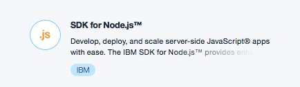
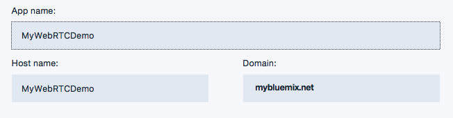
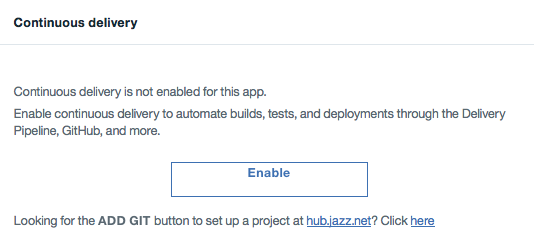
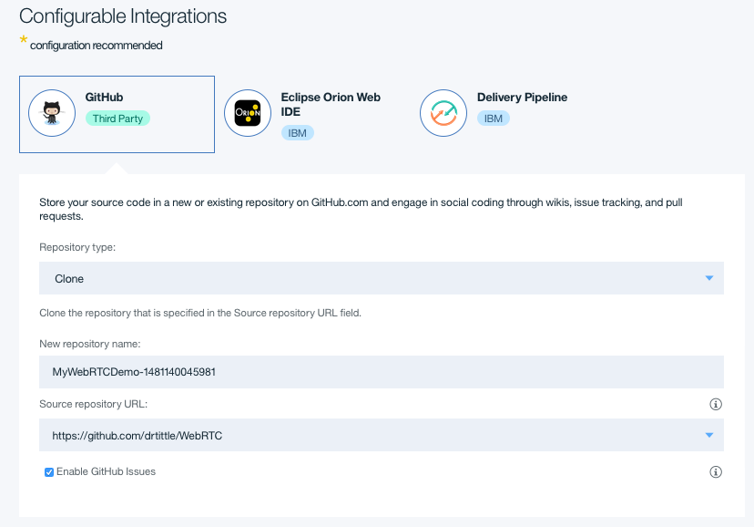
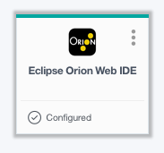
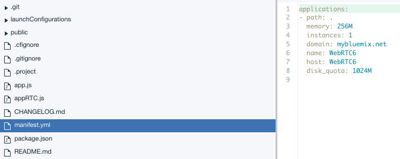

# ICal Node.js Starter Overview
# How to read a Google Calendar

The ICal Node.js Starter demonstrates a simple, reusable Node.js web application based on the Express framework that is implementing
ICal reading for Google calendar files.

This application highlights many technologies and also shows how to easily extend a Node.js by accessing other packages and having NPM (Node Package Manager) manage the application so it's available to the application.

## Instructions for using the ICal application.

TODO

## To use it:
1. TODO
2. 
3. 
4. 

## Prequisites
1. A Bluemix account
2. Access to Github

## Create using your Bluemix Dashboard
1. [Create a Node.js Runtime](https://console.ng.bluemix.net/catalog/starters/sdk-for-nodejs/?taxonomyNavigation=apps)   
      
2. Enter a unique Application Name and Host Name   
         
3. Enable Continuous Delivery   
         
4. Configure GitHub Repository
   
   and overwrite the default Source Repository URL setting with the following [GitHub Link]: https://github.com/drtittle/ICal     
5. Click 'Create'   
6. Open the Eclipse Web IDE   
         
7. Edit the Manifest.yml file changing the 'name;' and 'host:' entries to match the values you entered in Step #2 above.
      
   and 'Save' the file.      
8. Goto the Github tab   
      
   and enter a comment, select 'Commit' and then 'Sync'.   
   
Now, this should cause the pre-provided 'Build' and 'Deploy' stages of the Delivery Pipeline to start, which will cause the new code from the cloned GitHub repository to overwite the original Node.js applcation.

You're ready to share video, audio and chat over Bluemix!

## Run the app locally

1. [Install Node.js][]
2. Download and extract the starter code from the Bluemix UI
3. cd into the app directory
4. Run `npm install` to install the app's dependencies
5. Run `npm start` to start the app
6. Access the running app in a browser at http://localhost:6001

[Install Node.js]: https://nodejs.org/en/download/
